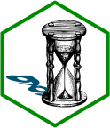

```{r, include = FALSE}
knitr::opts_chunk$set(
  collapse = TRUE,
  comment = "#>",
  fig.path = "man/figures/README-",
  fig.ext = "png",
  dev = "png")
library(ggplot2)
theme_set(theme_light())
```

# openmpt 

<!-- badges: start -->
[](https://github.com/pepijn-devries/gghourglass/actions/workflows/R-CMD-check.yaml)
<!-- badges: end -->

TODO

## Installation

Install latest developmental version from R-Universe:

``` r
install.packages("gghourglass", repos = c('https://pepijn-devries.r-universe.dev', 'https://cloud.r-project.org'))
```

## Example

```{r example, fig.width=7, fig.height=3, eval=TRUE}
library(ggplot2)
library(gghourglass)

data(bats)

monitoring <- attr(bats, "monitoring")

ggplot(subset(bats, format(RECDATETIME, "%Y") == "2018"),
      aes(x = RECDATETIME, col = SPECDESCSCI)) +
  annotate_daylight(monitoring$longitude[1], monitoring$latitude[1]) +
  annotate_daylight(monitoring$longitude[1], monitoring$latitude[1], c("dusk", "dawn")) +
  geom_hourglass() +
  labs(x = "Date", y = "Time of day", col = "Species")
```

TODO
