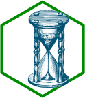
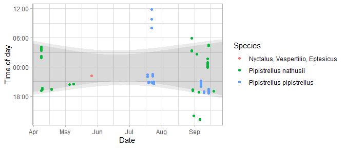

# gghourglass 

<!-- badges: start -->

[](https://github.com/pepijn-devries/gghourglass/actions/workflows/R-CMD-check.yaml)
[](https://pepijn-devries.r-universe.dev/gghourglass)
[](https://app.codecov.io/gh/pepijn-devries/gghourglass?branch=master)
<!-- badges: end -->

Splits observations with datetime stamps into a date and time of day
components, then displays them in a scatter plot using grammar of
graphics ([ggplot2](https://ggplot2.tidyverse.org/)). Plots can also be
decorated with coloured ribbons indicating night time. This is helpful
for data that are associated with the solar cycle, such as bat activity.

## Installation

Install latest developmental version from R-Universe:

``` r
install.packages("gghourglass", repos = c('https://pepijn-devries.r-universe.dev', 'https://cloud.r-project.org'))
```

## Example

``` r
## load required namespaces
library(ggplot2)
library(gghourglass)

## get example data
data(bats)

## subset example date to the year 2018
bats_sub <- subset(bats, format(RECDATETIME, "%Y") == "2018")

## retrieve monitoring location
lon <- attr(bats, "monitoring")$longitude[1]
lat <- attr(bats, "monitoring")$latitude[1]

## plot the data
ggplot(bats_sub, aes(x = RECDATETIME, col = SPECDESCSCI)) +
  
  ## annotate sunset until sunrise
  annotate_daylight(lon, lat) +
  
  ## annotate dusk until dawn
  annotate_daylight(lon, lat, c("dusk", "dawn")) +
  
  ## add hourglass geometry to plot
  geom_hourglass() +
  
  ## add informative labels
  labs(x = "Date", y = "Time of day", col = "Species")
```

<!-- -->
